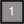
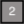
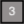
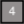
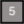
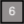
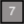
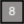

# Mynes
Pod7 coming up with a game Mynes, which inspired by Minesweeper 

---

## Navigation
- [Description](#description)
- [Controls](#controls)
- [How to Install](#how-to-install)
- [Project Structure](#structure)
- [Extend the Game](#extend-the-game)
- [Individual Contributions](#individual-contributions)
- [Licence Information](#licence-information)
---
## Description
---
Mynes is a game where you need to use logic to find out all the underlying mines. We remake Minesweeper and create a simpler version for beginners to Minesweeper. In the game window, there exist three different kinds of items: mines, numbers and flag. The rule is similar to minesweeper: you need to reveal all the number squares and flag all the mines. 

## Controls
---
* Left Click --> Reveal squares

* Right Click --> Flag squares

* After you flag all the mines, if the game finds that you flag some of the numbers, not mines, lose message will show up. If you left click on mines, lose message will also show up.

* If all flags correspond to all mines, win message will show up. 

[Back To The Top](#Mynes)
##  How to Install
---
To install the game you need to type this code into the terminal/cmd.

> pip install https://github.com/milindvishnoi/Pod7.git

This command will install the game to your computer, if it doesn't please contact me on milindvishnoi@gmail.com. 

Enjoy our game!

[Back To The Top](#Mynes)
##  Project Structure
---
#### File Structure
* All code and github related files are stored in the project directory.
* All unit testing files are located in the "MyneTest" folder.
* All images used (0-8, empty, mine, and flag) are stored in the "Icons" folder.

That's it!

#### Code Structure
This is a breakdown of each file's methods and what they do, in the order that the files reference each other.  For a more specific description, check the code and docstrings.

1. **MynesLauncher:**   Simply has a main method that initializes and runs a new Mynes game. (This is so you can double-click to launch.)

2. **Mynes:**   This class is the main game class that handles most of the "front-end" functionality.
  * Initializes a new board for the game to be played on.
  * Calls a new pygame instance to be displayed, and recieve events from.
  * Keeps track of play time after the instance is created, and flag count while the game is running.
  * Handles events, but the only two that matter are left and right clicking:
    * Left click "Opens" (clears) squares when the player clicks on a certain MyneSquare.  If that square has a Myne, then all squares are revealed and the game is lost.  This calls `end_game_message()`.
    * Right click places a flag, calling `flagging()` and updating the appropriate square with a flag image.  If all Mynes are flagged after this event, `show_win_message()` will display the win message after the next click.
    
3. **MynesBoard:**   This board handles a matrix of MyneSquare objects that correspond to grid places, and the actions involving said squares.
* Mynes are placed randomly with `place_mine()` when the board is intialized.
* After the Mynes are placed, `place_numbers()` assigns each square a number basedon the amount of Mynes adjacent to that square.
* The board can also check is a given square coordinate is valid or not using `inbound()`.

4. **MyneSquare:**   These squares are an object representation of the board squares, making it easier to track where user clicks happen and what to do on such events.
* Each square has a rectangle hitbox object, which is used to detect user clicks.
* Each square has a value, which determines which icon it gets (-1 for Mynes, 0-8 for empty or adjacent squares).
* Each square has a flag attribute, which can be placed or removed with `flagging()` and `unflagging()` respectively.
* Each square can also be "opened" to reveal what is underneath it.

[Back To The Top](#Mynes)
## Extend the Game
---

[Back To The Top](#Mynes)
## Individual Contributions
---
* Milind Vishnoi: 
I created the win_condition method. The purpose of this method is to close the execution of the application. The win_condition method checks to see if all the squares with the bombs are already flagged or not. Furthermore the  implementation of the multiple_open_square method was also done by me. The multiple_open_square method was implemented to recursively open multiple squares. This is done when the squares value is 0. If the value of the squares is equal to 0 then the recursion continues, if the value fails to equal 0 then it stops. 
Next off, I also fixed the functionality of other methods. There was no limit to flagging the number of sqaures. I made changes to the implementation of the flagging function, so that the number of flags would be equal to the number of bombs. Additionally a condition which would show all the bombs once the game ends was added aswell. Lastly, I also added a condition that restricted the user to only flag closed squares. 

* Arjun Ganguly: 
I did...

* Yang Zhang: 
I created the timer feature and fixed the win message bug. And I reorganized the game window to show the flag counter and timer. The timer starts when the pygame is run, and keep running until the player loses or wins the game. Then I placed timer and flag counter at the bottom of the pygame window. The win message cannot show up because pygame.display.flip() is called twice after the player wins. I fixed this bug and also created a few test cases for MyneSquare and MyneBoard. Finally, I completed description and controls for my game.

* Justin Paglia: 
I got carried away at the start of this project and set up basic versions of the four main classes (Mynes, MynesBoard, MyneSquare, MynesLauncher).  In Mynes I figured out how pygame launches, runs, and quits in order to get the game window working.  I also set up some event handling including the left and right click functions, as well as winning or losing the game (which has since been improved).

For MynesBoard, I wrote the basic board generator, which initializes the MyneSquare objects, and randomly places the mines.  The MyneSquares initializer was created by me as well.

MynesLauncher simply runs the game, and has remained unchanged.  I also made some temporary images to prove that the game was partially functional (myne, flag, and empty) which have since been updated.

* Min Hyeok Lee: 
Through out the project I have Created "open() and flagging()" method in MyneSquare.py. The "open()" method detects the mouse event and changes the state of square by revealing what is inside. The "flagging()" is to place a flag on the square to remind that the square is a mine. Also in MynesBoard.py, I added the number initialization after placing mynes. It iterates through all the squares on the board and counts the number of mynes surrounding that square. Therefore, when the myne game is initiated, board with mynes and numbers are initialized. Lastly, I have created the license.md for our project

[Back To The Top](#Mynes)
## Licence Information
---
The MIT License (MIT)

Copy right © 2019 Pod7

You can find a copy of the License at file <tt>LICENSE</tt>

License for them is in <tt>Public Domain</tt>

[Back To The Top](#Mynes)
